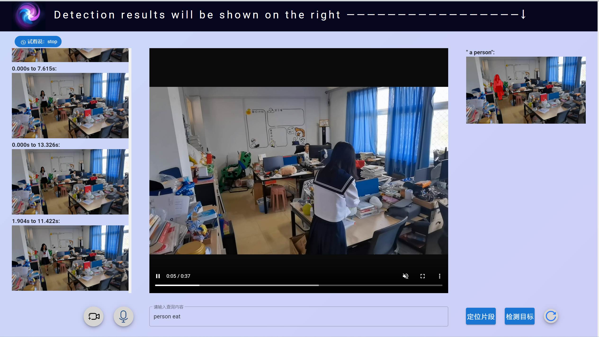

# 模态探索者

# 一、安装引导

## 1.安装后端

（1）下载模型权重
    
下载测试数据集，解压到data文件夹：https://www.dropbox.com/sh/dszrtb85nua2jqe/AABGAEQhPtqBIRpGPY3gZey6a?dl=0

下载定位权重文件，解压到checkpoints文件夹：https://www.dropbox.com/sh/27i8wvwk9cw521f/AAA4FJVDFVQZSjBoWC2x8NAIa?dl=0

下载检测权重文件，解压到LAVT-RIS-main/checkpoints文件夹：https://drive.google.com/file/d/13D-OeEOijV8KTC3BkFP-gOJymc6DLwVT/view?usp=sharing

（2）使用conda安装环境：

使用根目录下的TAN-and-LAVT.yml文件，执行命令：
    
    conda env create -f TAN-and-LAVT.yml
    conda activate TAN-and-LAVT

（3）进入根目录，运行moment_localization/app.py:

    python moment_localization/app.py

（4）后端启动。

## 2.安装前端

（1）安装vue所需依赖包，随后启动：

    npm install
    npu run serve

（2）前端启动。

## 3.运行网页

访问 localhost:8765/#/ 即可。

# 二、使用引导

## 1.Fusion Finders首页

（1）教学及应用部分：

在第一页，从上到下依次为GitHub、软件介绍、功能学习及使用和数据展示。点击中部按钮可以选择入门学习或应用。在应用部分有监控检索、远程关怀、动物检测和事故处理四大应用实例。

（2）介绍及自由尝试部分：

在第二页，从上到下依次是对后端模型baseline的介绍、所融合的模态介绍以及自由尝试入口。通过绿色GO图标可自由尝试网页，在此页面用户可以上传视频并进行提问。

## 2.新手入门学习

（1）引导者：在此页面中，设计了“引导者”对新手进行使用指引。用户可先于页面左下角上传视频，完成此步骤或点击“引导者”时，即可跳转到下一步。

（2）语音助手：系统内置了语音识别功能和语言翻译功能，前者可将用户的指令转为操作，后者则方便用户使用母语提问。语音助手将持续接收内容或指令并响应。具体的指令如下：
    
    reset：清空输入内容，重新输入。
    location：根据输入内容对视频片段进行定位。
    detection：根据输入内容对指代的目标进行检测。
    stop：停止语音识别，语音助手退出。
    其他：将用户所描述内容识别到输入框。

（3）视频片段定位：在上传视频并进行相关描述后，用户可通过语音助手或右侧“定位片段”按钮进行视频片段定位。视频片段定位的时间取决于云服务器的拥挤程度。当计算完成后，在页面左侧将显示视频中5个与描述相符合的片段，点击对应片段即可播放。

（4）指代目标检测：在上传视频并进行相关描述后，用户可通过语音助手或右侧“检测目标”按钮进行视频片段定位。指代目标检测的时间取决于云服务器的拥挤程度。点击检测后，系统将截取当前时刻的视频帧，并在页面右侧显示；检测结束后，系统将当前帧替换为检测分割后的图片，图片支持放大查看。
（5）翻译助手：用户可以使用母语在输入框进行条件描述，系统会将其实时翻译为英文来调用模型，提高所得结果的精确度。

## 3.监控检索

（1）应用场景：通过前期需求分析调查，发现大约有87%的问卷参与者有过丢失物品后需要调取监控的经历，而对监控的查找往往需要耗费较大的时间和人力。因此，我们推出针对视频监控的检索系统，系统通过使用监控数据训练后的模型对视频内容进行检索，可以极大降低人工查找的时间成本。

（2）操作方式：为了降低学习成本，此页面结构与新手入门的页面具有相似性，用户可以通过语音或文字输入想要检索的片段，如“一个人进来且拿走了一本书”，系统将对输入的监控视频片段进行检索并返回相关结果。与此同时，用户可以对特定视频帧进行提问，截取出期望目标。

## 4.远程关怀

（1）应用场景：近年来，独居老人的看护问题一直处于社会焦点，绝大部分老年人在独居时都有可能会因自身疾病或意外事故而身处险境。因此，我们模拟如下场景，期冀能够改善此类情况：在特定房间中布置摄像头采集老人的活动数据，当老人遇到危险或困难时，如：摔倒，连接着摄像头的模态探索者就可以检测到这一情况并及时通知家属。这样可以大大缩短滞后时间，为独居老人提供了宝贵的救援时间。

（2）操作方式：为了降低学习成本，此页面结构与新手入门的页面具有相似性，用户可以通过语音或文字输入想要检索的片段，如“一个人摔倒了”，系统将对输入的监控视频片段进行检索并返回相关结果。与此同时，用户也可以对特定视频帧进行提问，截取出期望目标。

## 5.动物检测

（1）应用场景：对生态研究者来说，他们需要获取野生动物或珍稀物种的视频图片，因此需要长时间将相机置于他们可能的出现区域进行录制，而录制之后对视频的检索同样耗费人力。因此，此系统应该实现对一段视频片段中动物的检测，且及时返回结果。

（2）操作方式：为了降低学习成本，此页面结构与新手入门的页面具有相似性，用户可以通过语音或文字输入想要检索的片段，如“一只猫出现”，系统将对输入的监控视频片段进行检索并返回相关结果。与此同时，用户也可以对特定视频帧进行提问，截取出期望目标。

## 6.事故处理

（1）应用场景：模态探索者可以对道路交通摄像头的数据进行采集和分析。举例如下：当执法者需要调查特定事故的发生时间时，无需人工检索，只需要在页面输入指令，如“两辆车相撞”，系统就将返回相应的结果，并可以根据后续提供的细节视频对场景进行重现。

（2）操作方式：为了降低学习成本，此页面结构与新手入门的页面具有相似性，用户可以通过语音或文字输入想要检索的片段，如“两辆车相撞”，系统将对输入的监控视频片段进行检索并返回相应结果。与此同时，用户可以对特定视频帧进行条件限制，截取出期望目标。

（3）三维重建：在系统首页，通过“事故处理”按钮可以找到相应的“场景还原”按钮，进入此页面后，用户可以上传细节视频和自己的联系方式，系统将对事故现场进行三维重建，有助于事故纠纷解决和事故原因分析等。由于技术限制，三维重建所需时间较长，所以系统重建完成后会将结果通过邮件的方式发给用户。

